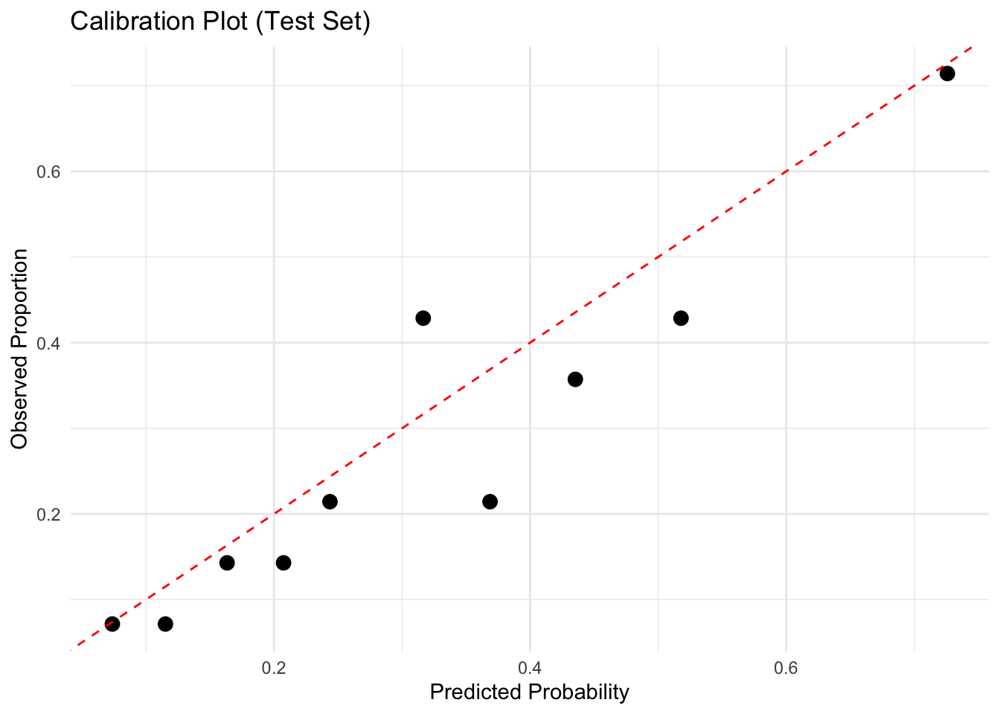

# Summary
A logistic regression model predicting heart failure risk from clinical data (N = 700). 
Older age, lower ejection fraction, and higher NT-proBNP were the strongest predictors. 
The model achieved an AUC of 0.75 with good calibration (Hosmer-Lemeshow p = .876).

# Results

Test set performance (N = 140):
- AUC: 0.75 (95% CI: 0.66 - 0.83)
- Sensitivity: 79.5%
- Specificity: 59.4%
- Accuracy: 65.0%

Final model odds ratios:
- Age (1 year): OR = 1.03 (95% CI: 1.01 - 1.05), p < .001
- Ejection fraction (1%): OR = 0.94 (95% CI: 0.91 - 0.98), p < .001
- NT-proBNP (1 pg/mL): OR = 1.001 (95% CI: 1.001 - 1.002), p = .011
- eGFR (1 unit): OR = 0.98 (95% CI: 0.96 - 1.00), p = .018
- Sex (male vs female): OR = 1.73 (95% CI: 1.12 - 2.71), p = .015
- Atrial fibrillation: OR = 2.91 (95% CI: 0.82 - 11.60), p = .110

# Methods
Data was split into training (80%, n = 560) and testing (20%, n = 140) sets. 
Logistic regression was used because the outcome is binary (heart failure present or absent). 
Variable selection was performed using bidirectional stepwise AIC on the training data. The final model included six predictors: age, ejection fraction, NT-proBNP, eGFR, sex, and atrial fibrillation. 
Five-fold cross-validation was used to assess model stability. Calibration was evaluated using the Hosmer-Lemeshow test. 
Bootstrap resampling (100 iterations) was used to calculate confidence intervals for the AUC. Subgroup analysis stratified by age (under 65 vs 65 and over)was conducted to test whether predictor effects differed by age group.

